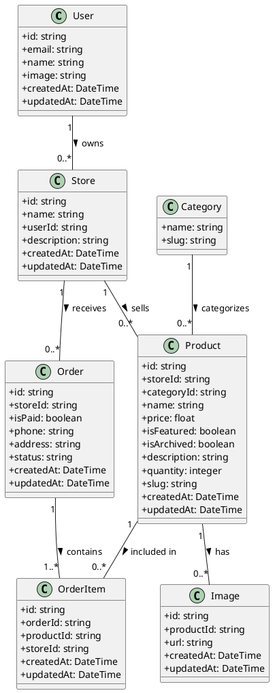

# Skaters E-Commerce Class Diagram

This Class Diagram illustrates the main entities in the Skaters e-commerce system and their relationships, representing the core data structure of the application.
