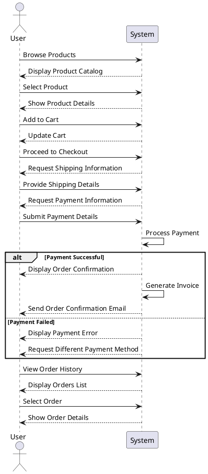

# Skaters E-Commerce System Sequence Diagram

This System Sequence Diagram focuses on the interactions between a User and the Skaters E-commerce System during a typical shopping flow, from browsing products to completing a purchase and viewing order details.
