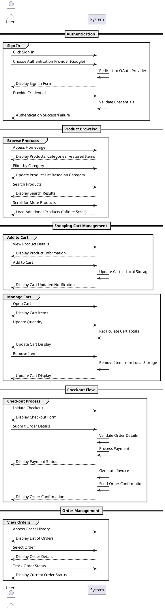

# Skaters E-Commerce System Sequence Diagram

## System Sequence Diagram Description

This System Sequence Diagram (SSD) shows the interactions between a User and the Skaters E-Commerce System. It illustrates the main user flows in chronological order:

### Authentication Flow
Shows how users sign in to the platform using Google OAuth authentication.

### Product Browsing Flow
Demonstrates how users browse products, including filtering by categories, searching, and infinite scrolling for more products.

### Shopping Cart Management Flow
Illustrates the process of adding items to the cart and managing cart items (updating quantities, removing items).

### Checkout Flow
Shows the complete checkout process from initiating checkout to receiving order confirmation.

### Order Management Flow
Demonstrates how users view their order history and track the status of specific orders.

The diagram focuses on the direct interactions between the user and the system without showing internal system components or database interactions. This high-level view helps understand the main user interactions with the system.
