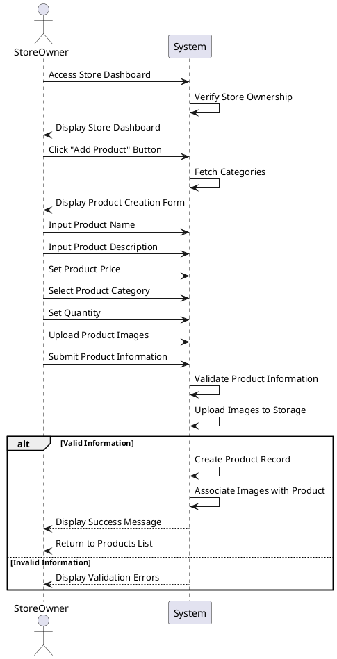

# Add Product - System Sequence Diagram

```plantuml
@startuml Add Product - System Sequence Diagram

actor StoreOwner
participant System

StoreOwner -> System: Access Store Dashboard
System -> System: Verify Store Ownership
System --> StoreOwner: Display Store Dashboard

StoreOwner -> System: Click "Add Product" Button
System -> System: Fetch Categories
System --> StoreOwner: Display Product Creation Form

StoreOwner -> System: Input Product Name
StoreOwner -> System: Input Product Description
StoreOwner -> System: Set Product Price
StoreOwner -> System: Select Product Category
StoreOwner -> System: Set Quantity
StoreOwner -> System: Upload Product Images
StoreOwner -> System: Submit Product Information

System -> System: Validate Product Information
System -> System: Upload Images to Storage
alt Valid Information
    System -> System: Create Product Record
    System -> System: Associate Images with Product
    System --> StoreOwner: Display Success Message
    System --> StoreOwner: Return to Products List
else Invalid Information
    System --> StoreOwner: Display Validation Errors
end

@enduml
```

This System Sequence Diagram illustrates the interaction between a Store Owner and the System when adding a new product to their store.
