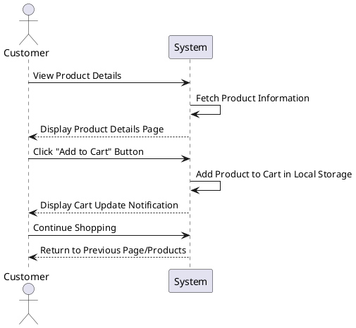

# Add to Cart - System Sequence Diagram

```plantuml
@startuml Add to Cart - System Sequence Diagram

actor Customer
participant System

Customer -> System: View Product Details
System -> System: Fetch Product Information
System --> Customer: Display Product Details Page

Customer -> System: Click "Add to Cart" Button
System -> System: Add Product to Cart in Local Storage
System --> Customer: Display Cart Update Notification

Customer -> System: Continue Shopping
System --> Customer: Return to Previous Page/Products

@enduml
```

This System Sequence Diagram shows the interaction between a Customer and the System when adding a product to the shopping cart.
