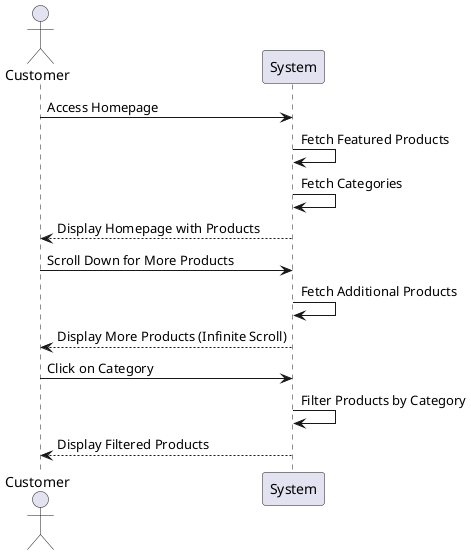

# Browse Products - System Sequence Diagram

This System Sequence Diagram shows the interactions between a Customer and the System when browsing products, including the infinite scroll feature and category filtering.
