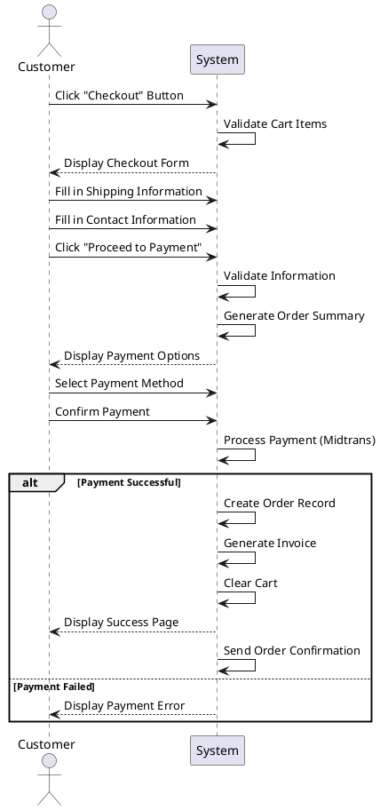

# Checkout - System Sequence Diagram

```plantuml
@startuml Checkout - System Sequence Diagram

actor Customer
participant System

Customer -> System: Click "Checkout" Button
System -> System: Validate Cart Items
System --> Customer: Display Checkout Form

Customer -> System: Fill in Shipping Information
Customer -> System: Fill in Contact Information
Customer -> System: Click "Proceed to Payment"

System -> System: Validate Information
System -> System: Generate Order Summary
System --> Customer: Display Payment Options

Customer -> System: Select Payment Method
Customer -> System: Confirm Payment
System -> System: Process Payment (Midtrans)

alt Payment Successful
    System -> System: Create Order Record
    System -> System: Generate Invoice
    System -> System: Clear Cart
    System --> Customer: Display Success Page
    System -> System: Send Order Confirmation
else Payment Failed
    System --> Customer: Display Payment Error
end

@enduml
```

This System Sequence Diagram illustrates the interaction between a Customer and the System during the checkout process, including payment processing.
