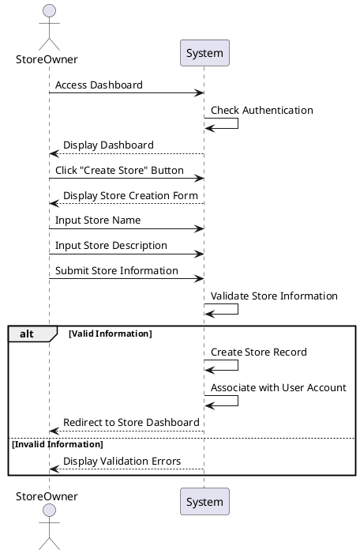

# Create Store - System Sequence Diagram

```plantuml
@startuml Create Store - System Sequence Diagram

actor StoreOwner
participant System

StoreOwner -> System: Access Dashboard
System -> System: Check Authentication
System --> StoreOwner: Display Dashboard

StoreOwner -> System: Click "Create Store" Button
System --> StoreOwner: Display Store Creation Form

StoreOwner -> System: Input Store Name
StoreOwner -> System: Input Store Description
StoreOwner -> System: Submit Store Information

System -> System: Validate Store Information
alt Valid Information
    System -> System: Create Store Record
    System -> System: Associate with User Account
    System --> StoreOwner: Redirect to Store Dashboard
else Invalid Information
    System --> StoreOwner: Display Validation Errors
end

@enduml
```

This System Sequence Diagram shows the interaction between a Store Owner and the System when creating a new store on the platform.
