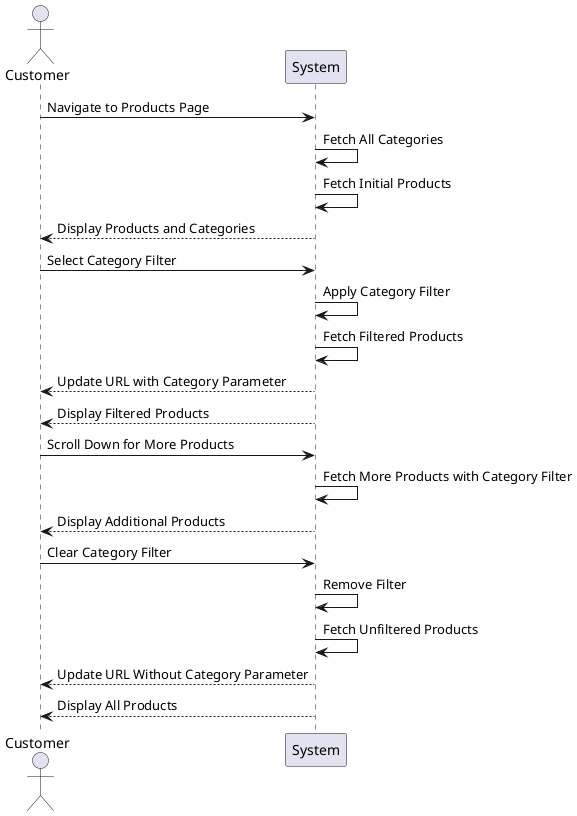

# Filter Products by Category - System Sequence Diagram

```plantuml
@startuml Filter Products by Category - System Sequence Diagram

actor Customer
participant System

Customer -> System: Navigate to Products Page
System -> System: Fetch All Categories
System -> System: Fetch Initial Products
System --> Customer: Display Products and Categories

Customer -> System: Select Category Filter
System -> System: Apply Category Filter
System -> System: Fetch Filtered Products
System --> Customer: Update URL with Category Parameter
System --> Customer: Display Filtered Products

Customer -> System: Scroll Down for More Products
System -> System: Fetch More Products with Category Filter
System --> Customer: Display Additional Products

Customer -> System: Clear Category Filter
System -> System: Remove Filter
System -> System: Fetch Unfiltered Products
System --> Customer: Update URL Without Category Parameter
System --> Customer: Display All Products

@enduml
```

This System Sequence Diagram shows the interaction between a Customer and the System when filtering products by category.
