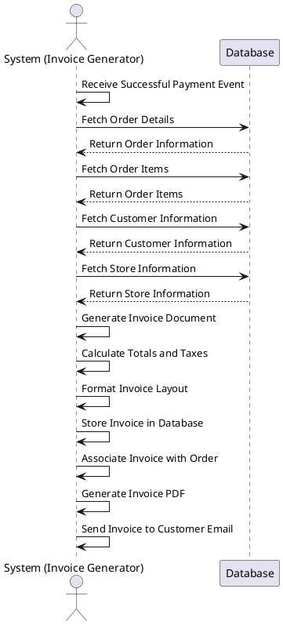

# Generate Invoice - System Sequence Diagram

```plantuml
@startuml Generate Invoice - System Sequence Diagram

actor System as "System (Invoice Generator)"
participant Database

System -> System: Receive Successful Payment Event
System -> Database: Fetch Order Details
Database --> System: Return Order Information

System -> Database: Fetch Order Items
Database --> System: Return Order Items

System -> Database: Fetch Customer Information
Database --> System: Return Customer Information

System -> Database: Fetch Store Information
Database --> System: Return Store Information

System -> System: Generate Invoice Document
System -> System: Calculate Totals and Taxes
System -> System: Format Invoice Layout

System -> System: Store Invoice in Database
System -> System: Associate Invoice with Order

System -> System: Generate Invoice PDF
System -> System: Send Invoice to Customer Email

@enduml
```

This System Sequence Diagram illustrates the internal system processes when generating an invoice after a successful payment.
