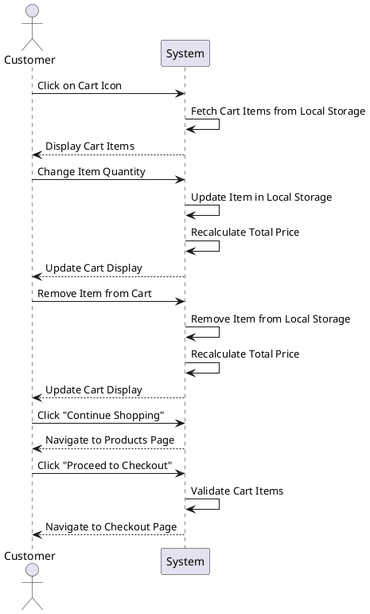

# Manage Cart Items - System Sequence Diagram

```plantuml
@startuml Manage Cart Items - System Sequence Diagram

actor Customer
participant System

Customer -> System: Click on Cart Icon
System -> System: Fetch Cart Items from Local Storage
System --> Customer: Display Cart Items

Customer -> System: Change Item Quantity
System -> System: Update Item in Local Storage
System -> System: Recalculate Total Price
System --> Customer: Update Cart Display

Customer -> System: Remove Item from Cart
System -> System: Remove Item from Local Storage
System -> System: Recalculate Total Price
System --> Customer: Update Cart Display

Customer -> System: Click "Continue Shopping"
System --> Customer: Navigate to Products Page

Customer -> System: Click "Proceed to Checkout" 
System -> System: Validate Cart Items
System --> Customer: Navigate to Checkout Page

@enduml
```

This System Sequence Diagram illustrates the interaction between a Customer and the System when managing items in the shopping cart.
