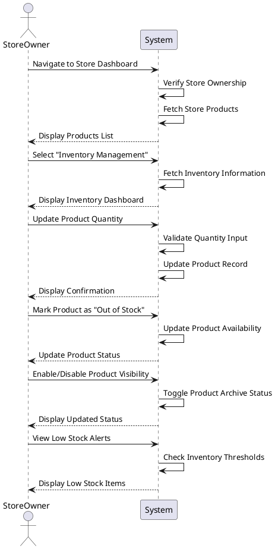

# Manage Product Inventory - System Sequence Diagram

```plantuml
@startuml Manage Product Inventory - System Sequence Diagram

actor StoreOwner
participant System

StoreOwner -> System: Navigate to Store Dashboard
System -> System: Verify Store Ownership
System -> System: Fetch Store Products
System --> StoreOwner: Display Products List

StoreOwner -> System: Select "Inventory Management"
System -> System: Fetch Inventory Information
System --> StoreOwner: Display Inventory Dashboard

StoreOwner -> System: Update Product Quantity
System -> System: Validate Quantity Input
System -> System: Update Product Record
System --> StoreOwner: Display Confirmation

StoreOwner -> System: Mark Product as "Out of Stock"
System -> System: Update Product Availability
System --> StoreOwner: Update Product Status

StoreOwner -> System: Enable/Disable Product Visibility
System -> System: Toggle Product Archive Status
System --> StoreOwner: Display Updated Status

StoreOwner -> System: View Low Stock Alerts
System -> System: Check Inventory Thresholds
System --> StoreOwner: Display Low Stock Items

@enduml
```

This System Sequence Diagram shows the interaction between a Store Owner and the System when managing product inventory for their store.
