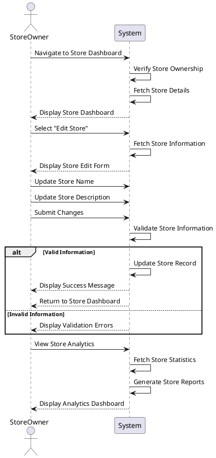

# Manage Store - System Sequence Diagram

```plantuml
@startuml Manage Store - System Sequence Diagram

actor StoreOwner
participant System

StoreOwner -> System: Navigate to Store Dashboard
System -> System: Verify Store Ownership
System -> System: Fetch Store Details
System --> StoreOwner: Display Store Dashboard

StoreOwner -> System: Select "Edit Store"
System -> System: Fetch Store Information
System --> StoreOwner: Display Store Edit Form

StoreOwner -> System: Update Store Name
StoreOwner -> System: Update Store Description
StoreOwner -> System: Submit Changes

System -> System: Validate Store Information
alt Valid Information
    System -> System: Update Store Record
    System --> StoreOwner: Display Success Message
    System --> StoreOwner: Return to Store Dashboard
else Invalid Information
    System --> StoreOwner: Display Validation Errors
end

StoreOwner -> System: View Store Analytics
System -> System: Fetch Store Statistics
System -> System: Generate Store Reports
System --> StoreOwner: Display Analytics Dashboard

@enduml
```

This System Sequence Diagram illustrates the interaction between a Store Owner and the System when managing their store information and viewing analytics.
