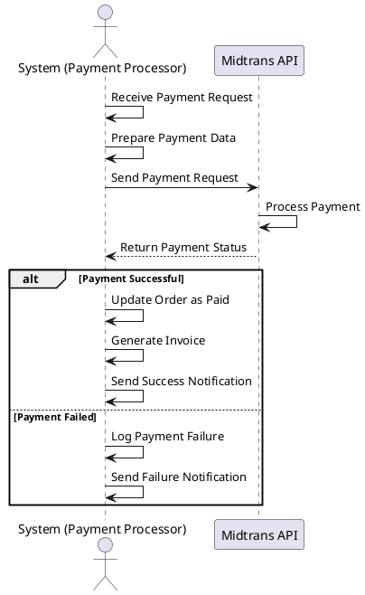

# Process Payment - System Sequence Diagram

```plantuml
@startuml Process Payment - System Sequence Diagram

actor System as "System (Payment Processor)"
participant "Midtrans API" as MidtransAPI

System -> System: Receive Payment Request
System -> System: Prepare Payment Data

System -> MidtransAPI: Send Payment Request
MidtransAPI -> MidtransAPI: Process Payment
MidtransAPI --> System: Return Payment Status

alt Payment Successful
    System -> System: Update Order as Paid
    System -> System: Generate Invoice
    System -> System: Send Success Notification
else Payment Failed
    System -> System: Log Payment Failure
    System -> System: Send Failure Notification
end

@enduml
```

This System Sequence Diagram illustrates the internal system interaction with the Midtrans payment gateway when processing a payment.
