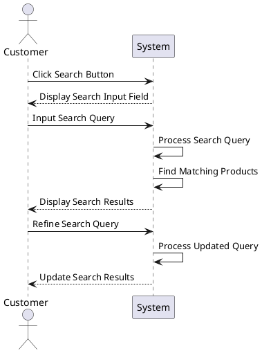

# Search Products - System Sequence Diagram

```plantuml
@startuml Search Products - System Sequence Diagram

actor Customer
participant System

Customer -> System: Click Search Button
System --> Customer: Display Search Input Field

Customer -> System: Input Search Query
System -> System: Process Search Query
System -> System: Find Matching Products
System --> Customer: Display Search Results

Customer -> System: Refine Search Query
System -> System: Process Updated Query
System --> Customer: Update Search Results

@enduml
```

This System Sequence Diagram illustrates the interaction between a Customer and the System when searching for products using the search functionality.
