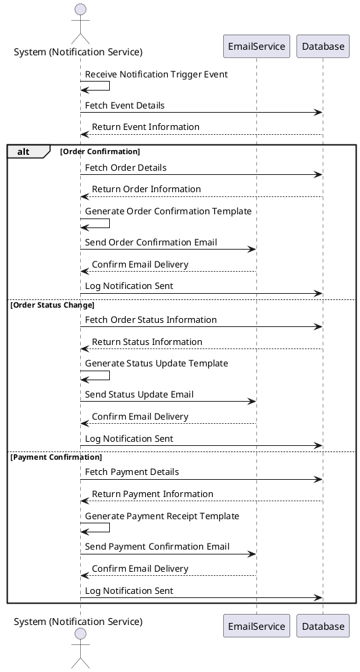

# Send Notifications - System Sequence Diagram

```plantuml
@startuml Send Notifications - System Sequence Diagram

actor System as "System (Notification Service)"
participant EmailService
participant Database

System -> System: Receive Notification Trigger Event
System -> Database: Fetch Event Details
Database --> System: Return Event Information

alt Order Confirmation
    System -> Database: Fetch Order Details
    Database --> System: Return Order Information
    System -> System: Generate Order Confirmation Template
    System -> EmailService: Send Order Confirmation Email
    EmailService --> System: Confirm Email Delivery
    System -> Database: Log Notification Sent
    
else Order Status Change
    System -> Database: Fetch Order Status Information
    Database --> System: Return Status Information
    System -> System: Generate Status Update Template
    System -> EmailService: Send Status Update Email
    EmailService --> System: Confirm Email Delivery
    System -> Database: Log Notification Sent
    
else Payment Confirmation
    System -> Database: Fetch Payment Details
    Database --> System: Return Payment Information
    System -> System: Generate Payment Receipt Template
    System -> EmailService: Send Payment Confirmation Email
    EmailService --> System: Confirm Email Delivery
    System -> Database: Log Notification Sent
end

@enduml
```

This System Sequence Diagram illustrates the internal system processes when sending different types of notifications to users.
