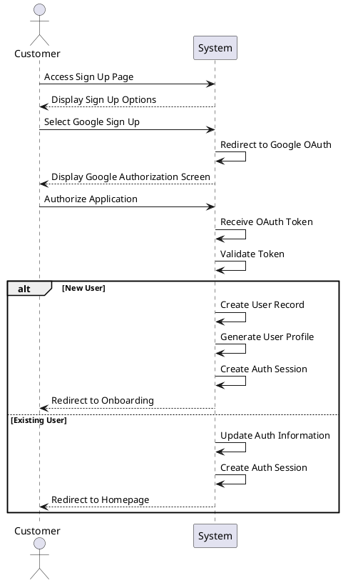

# Sign Up - System Sequence Diagram

```plantuml
@startuml Sign Up - System Sequence Diagram

actor Customer
participant System

Customer -> System: Access Sign Up Page
System --> Customer: Display Sign Up Options

Customer -> System: Select Google Sign Up
System -> System: Redirect to Google OAuth
System --> Customer: Display Google Authorization Screen

Customer -> System: Authorize Application
System -> System: Receive OAuth Token
System -> System: Validate Token

alt New User
    System -> System: Create User Record
    System -> System: Generate User Profile
    System -> System: Create Auth Session
    System --> Customer: Redirect to Onboarding
else Existing User
    System -> System: Update Auth Information
    System -> System: Create Auth Session
    System --> Customer: Redirect to Homepage
end

@enduml
```

This System Sequence Diagram shows the interaction between a Customer and the System during the sign-up process using Google OAuth.
