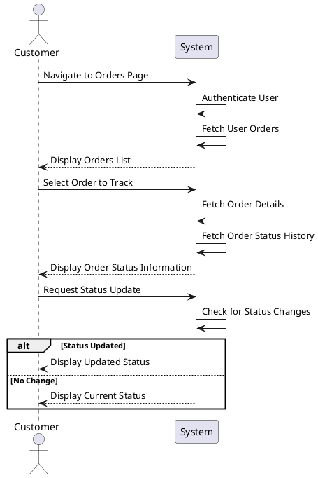

# Track Order Status - System Sequence Diagram

```plantuml
@startuml Track Order Status - System Sequence Diagram

actor Customer
participant System

Customer -> System: Navigate to Orders Page
System -> System: Authenticate User
System -> System: Fetch User Orders
System --> Customer: Display Orders List

Customer -> System: Select Order to Track
System -> System: Fetch Order Details
System -> System: Fetch Order Status History
System --> Customer: Display Order Status Information

Customer -> System: Request Status Update
System -> System: Check for Status Changes
alt Status Updated
    System --> Customer: Display Updated Status
else No Change
    System --> Customer: Display Current Status
end

@enduml
```

This System Sequence Diagram illustrates the interaction between a Customer and the System when tracking the status of an order.
