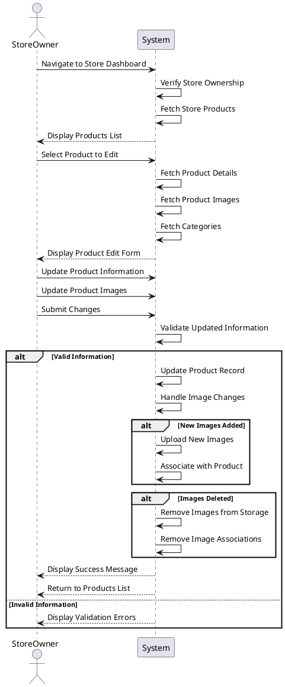

# Update Product - System Sequence Diagram

```plantuml
@startuml Update Product - System Sequence Diagram

actor StoreOwner
participant System

StoreOwner -> System: Navigate to Store Dashboard
System -> System: Verify Store Ownership
System -> System: Fetch Store Products
System --> StoreOwner: Display Products List

StoreOwner -> System: Select Product to Edit
System -> System: Fetch Product Details
System -> System: Fetch Product Images
System -> System: Fetch Categories
System --> StoreOwner: Display Product Edit Form

StoreOwner -> System: Update Product Information
StoreOwner -> System: Update Product Images
StoreOwner -> System: Submit Changes

System -> System: Validate Updated Information
alt Valid Information
    System -> System: Update Product Record
    System -> System: Handle Image Changes
    alt New Images Added
        System -> System: Upload New Images
        System -> System: Associate with Product
    end
    alt Images Deleted
        System -> System: Remove Images from Storage
        System -> System: Remove Image Associations
    end
    System --> StoreOwner: Display Success Message
    System --> StoreOwner: Return to Products List
else Invalid Information
    System --> StoreOwner: Display Validation Errors
end

@enduml
```

This System Sequence Diagram shows the interaction between a Store Owner and the System when updating an existing product in their store.
