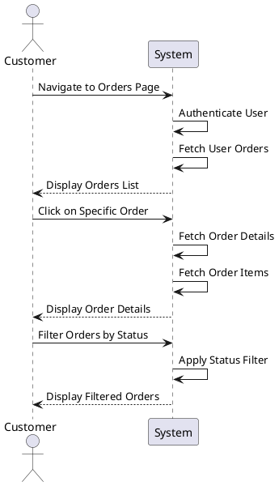

# View Order History - System Sequence Diagram

```plantuml
@startuml View Order History - System Sequence Diagram

actor Customer
participant System

Customer -> System: Navigate to Orders Page
System -> System: Authenticate User
System -> System: Fetch User Orders
System --> Customer: Display Orders List

Customer -> System: Click on Specific Order
System -> System: Fetch Order Details
System -> System: Fetch Order Items
System --> Customer: Display Order Details

Customer -> System: Filter Orders by Status
System -> System: Apply Status Filter
System --> Customer: Display Filtered Orders

@enduml
```

This System Sequence Diagram shows the interaction between a Customer and the System when viewing their order history and specific order details.
