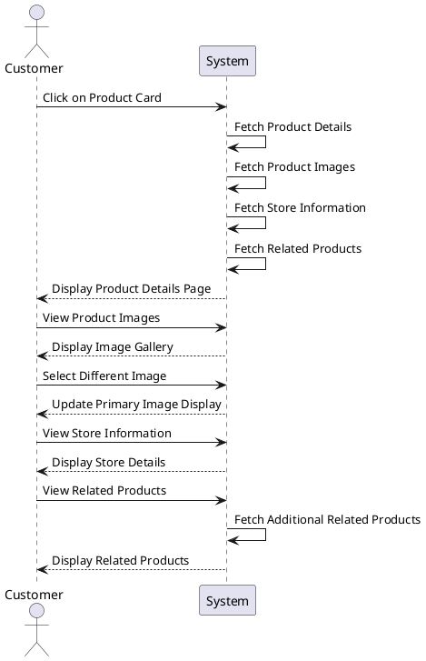

# View Product Details - System Sequence Diagram

```plantuml
@startuml View Product Details - System Sequence Diagram

actor Customer
participant System

Customer -> System: Click on Product Card
System -> System: Fetch Product Details
System -> System: Fetch Product Images
System -> System: Fetch Store Information
System -> System: Fetch Related Products
System --> Customer: Display Product Details Page

Customer -> System: View Product Images
System --> Customer: Display Image Gallery

Customer -> System: Select Different Image
System --> Customer: Update Primary Image Display

Customer -> System: View Store Information
System --> Customer: Display Store Details

Customer -> System: View Related Products
System -> System: Fetch Additional Related Products
System --> Customer: Display Related Products

@enduml
```

This System Sequence Diagram illustrates the interaction between a Customer and the System when viewing detailed product information.
