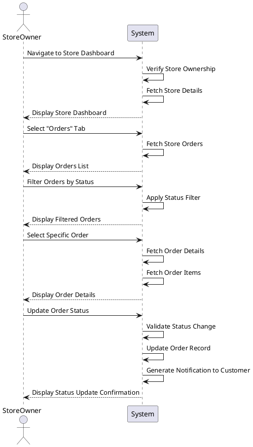

# View Store Orders - System Sequence Diagram

```plantuml
@startuml View Store Orders - System Sequence Diagram

actor StoreOwner
participant System

StoreOwner -> System: Navigate to Store Dashboard
System -> System: Verify Store Ownership
System -> System: Fetch Store Details
System --> StoreOwner: Display Store Dashboard

StoreOwner -> System: Select "Orders" Tab
System -> System: Fetch Store Orders
System --> StoreOwner: Display Orders List

StoreOwner -> System: Filter Orders by Status
System -> System: Apply Status Filter
System --> StoreOwner: Display Filtered Orders

StoreOwner -> System: Select Specific Order
System -> System: Fetch Order Details
System -> System: Fetch Order Items
System --> StoreOwner: Display Order Details

StoreOwner -> System: Update Order Status
System -> System: Validate Status Change
System -> System: Update Order Record
System -> System: Generate Notification to Customer
System --> StoreOwner: Display Status Update Confirmation

@enduml
```

This System Sequence Diagram shows the interaction between a Store Owner and the System when viewing and managing orders for their store.
