# Skaters E-Commerce Use Case Diagram

```plantuml
@startuml Skaters E-Commerce Use Case Diagram

' Actors
actor "Customer" as Customer
actor "Store Owner" as StoreOwner
actor "System" as System

' Main package
rectangle "Skaters E-Commerce Platform" {
  ' Authentication use cases
  usecase "Sign In" as SignIn
  usecase "Sign Up" as SignUp
  usecase "Sign Out" as SignOut
  
  ' Customer use cases
  usecase "Browse Products" as BrowseProducts
  usecase "Search Products" as SearchProducts
  usecase "Filter Products by Category" as FilterProducts
  usecase "View Product Details" as ViewProduct
  usecase "Add to Cart" as AddToCart
  usecase "Manage Cart Items" as ManageCart
  usecase "Checkout" as Checkout
  usecase "View Order History" as ViewOrders
  usecase "Track Order Status" as TrackOrder
  
  ' Store Owner use cases
  usecase "Create Store" as CreateStore
  usecase "Manage Store" as ManageStore
  usecase "Add Product" as AddProduct
  usecase "Update Product" as UpdateProduct
  usecase "View Store Orders" as ViewStoreOrders
  usecase "Manage Product Inventory" as ManageInventory
  
  ' System use cases
  usecase "Process Payment" as ProcessPayment
  usecase "Generate Invoice" as GenerateInvoice
  usecase "Send Notifications" as SendNotifications
}

' Customer relationships
Customer --> SignIn
Customer --> SignUp
Customer --> SignOut
Customer --> BrowseProducts
Customer --> SearchProducts
Customer --> FilterProducts
Customer --> ViewProduct
Customer --> AddToCart
Customer --> ManageCart
Customer --> Checkout
Customer --> ViewOrders
Customer --> TrackOrder

' Store Owner relationships
StoreOwner --> SignIn
StoreOwner --> SignUp
StoreOwner --> SignOut
StoreOwner --> CreateStore
StoreOwner --> ManageStore
StoreOwner --> AddProduct
StoreOwner --> UpdateProduct
StoreOwner --> ViewStoreOrders
StoreOwner --> ManageInventory

' System relationships
System --> ProcessPayment
System --> GenerateInvoice
System --> SendNotifications

' Include/extend relationships
Checkout .> ProcessPayment : <<include>>
ProcessPayment .> GenerateInvoice : <<include>>
ViewProduct .> AddToCart : <<extend>>
ManageStore .> AddProduct : <<include>>
ManageStore .> UpdateProduct : <<include>>
ManageStore .> ViewStoreOrders : <<include>>

@enduml
```

## Use Case Descriptions

### Customer Use Cases

1. **Sign In**: Authenticate using Google OAuth provider
2. **Sign Up**: Register a new account using Google OAuth provider
3. **Sign Out**: End the current session
4. **Browse Products**: View products list with infinite scrolling
5. **Search Products**: Find products by name
6. **Filter Products by Category**: Browse products by skateboard category (Skateboards, Clothing, Shoes, Accessories)
7. **View Product Details**: See product info, images, price, and seller information
8. **Add to Cart**: Add a product to shopping cart
9. **Manage Cart Items**: View, update, and remove items from cart
10. **Checkout**: Complete a purchase using Midtrans payment
11. **View Order History**: See past orders and their status
12. **Track Order Status**: Check the current status of an order

### Store Owner Use Cases

1. **Create Store**: Set up a new store on the platform
2. **Manage Store**: Update store information and settings
3. **Add Product**: Create new product listings with images, price, and details
4. **Update Product**: Edit existing product information
5. **View Store Orders**: See orders placed for products from the store
6. **Manage Product Inventory**: Update product availability

### System Use Cases

1. **Process Payment**: Handle transaction through Midtrans payment gateway
2. **Generate Invoice**: Create order invoice after successful payment
3. **Send Notifications**: Send confirmations and updates about orders
