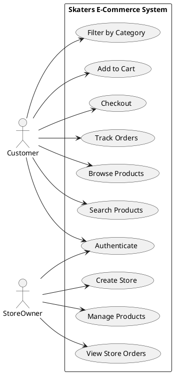

# Skaters E-Commerce Use Case Diagram

This Use Case Diagram presents a focused view of the core functionalities in the Skaters e-commerce platform. It identifies two primary actors (Customer and Store Owner) and their interactions with the system's key features.
